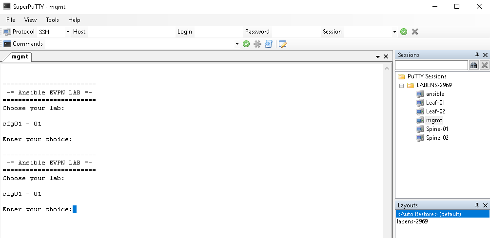
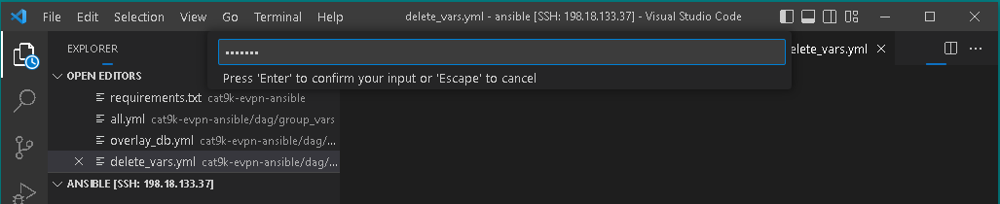
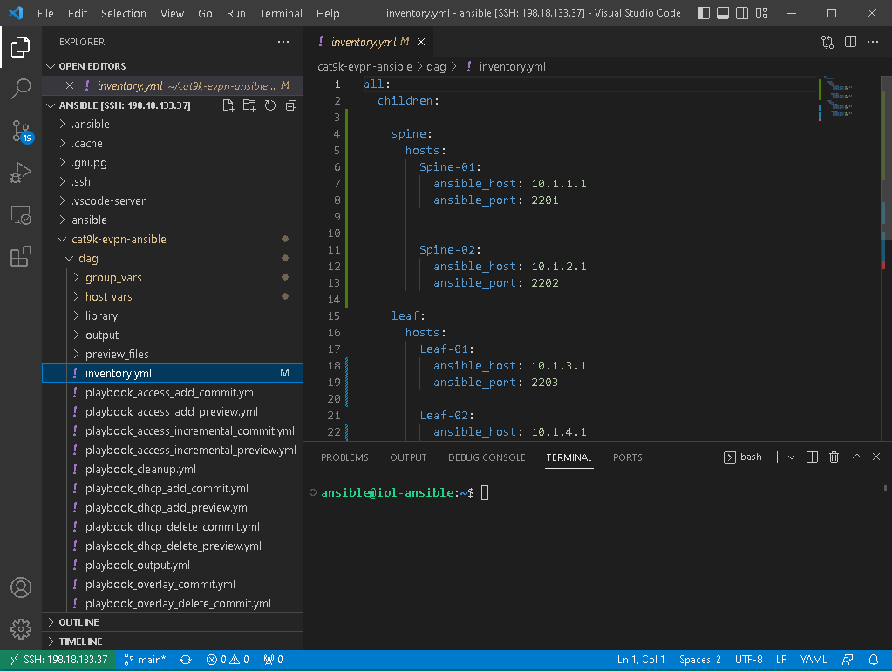

Get started
===============

Please, connect to lab via one of the presented connection options and then proceed to **Connecting to lab devices** section.

WIL workstation option
**********************

If you are sitting on WIL workstation, please click **Connect VPN** button.

BYOD Option
***********

Please connect to the lab with **Cisco AnyConnect** (you can get server name and credentials from WIL portal):

#. Start **Cisco AnyConnect** on your laptop
#. Copy the **Host** URL from the **AnyConnect Credentials** and then paste it in the **URL Connection box** in the **AnyConnect** login window.
#. Click connect

    .. image:: assets/anyconnect.png

#. If you get a connection error, remove the ``https://`` part of the URL and try the connection again.
#. Copy a User ID and the password from the **AnyConnect Credentials** and then paste each into the **Cisco AnyConnect** login window.
#. Click **OK**
#. Click **Accept** on the window confirming your connection.
#. When connected to your AnyConnect VPN session, the AnyConnect VPN icon is displayed in the system tray (Windows) or task bar (Mac).
#. To view connection details or to disconnect, click the AnyConnect VPN icon and then choose Disconnect.

Connecting to lab devices
*************************

After connecting to the VPN of the lab pod, use RDP to connect to the jumphost workstation.

    **IP Address**: 198.18.133.36

    **Credentials**: .\\admin / C1sco12345

On the jumphost, we have prepared for you **SuperPutty**, which will be used for connection to lab devices and as well **VSCode**, which we will use for easier navigation in file system and execution of our ansible playbooks. Both SuperPutty and VSCode icons are located on the desktop.

In the **SupperPutty**, you can find list of saved session in **LABENS-2969** folder. Via ``mgmt`` session, you can access  **lab manager**.  Please, use **lab manager** to initialize lab devices once you are asked to do so in corresponding task.  

You can open connections to all lab devices by selecting **Connect All** option once you will right-click on **LABENS-2969** folder.

When you will open **VSCode**, on the top of the window, you will receive prompt asking for password. Please, enter password ``ansible``.

.. note:: 

    Credentials for the ansible host are ansible / ansible.

When working with VSCode, you can use file navigation on the left side to open files in the middle section, so you can easily browse thru them and terminal section in the bottom to execute commands as instructed in the lab guide.

.. note:: 

    During the lab, you will combine both **SuperPutty**, to observe changes on devices after you will execute ansible playbook via **VSCode**.

