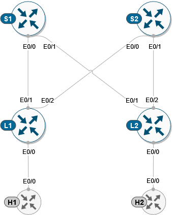

TASK 01: Prepare network devices for automation
===============================================

In this task, we will prepare our environment and devices for automation via ansible. This means that we will activate our virtual environment for python which have already preinstalled all necessary libraries and we will verify connectivity towards network devices.

First, we will start with activation of our virtual environment for python and we will enter project folder. This can be accomplished via commands below.

.. code-block:: console
    
    ansible@iol-ansible:~$ source ansible/bin/activate
    (ansible) ansible@iol-ansible:~$ cd cat9k-evpn-ansible/dag/
    (ansible) ansible@iol-ansible:~/cat9k-evpn-ansible/dag$ 

As you can see, after activation of virtual environment, prompt suffix will change to ``(ansible)`` indicating that virtual environment was activated. Now, lets start our lab devices and verify, that they are reachable.  For this, please login to ``lab manager`` and select lab number 1 -> ``01``.

After lab started, you may verify connectivity to each device via ping to below IP address. Please, note that it may a take few seconds prior device will become reachable after lab start. To break ping command, please execute CRTL+C.

.. list-table::
    :widths: 50 50
    :header-rows: 1

    * - Node name
      - IP address
    * - Spine-01
      - 10.1.1.1
    * - Spine-02
      - 10.1.2.1
    * - Leaf-01
      - 10.1.3.1
    * - leaf-02
      - 10.1.4.1

.. code-block:: console

    ansible@iol-ansible:~/cat9k-evpn-ansible$ ping 10.1.1.2
    PING 10.1.1.2 (10.1.1.2) 56(84) bytes of data.
    64 bytes from 10.1.1.2: icmp_seq=2 ttl=255 time=0.419 ms
    64 bytes from 10.1.1.2: icmp_seq=3 ttl=255 time=0.293 ms
    64 bytes from 10.1.1.2: icmp_seq=4 ttl=255 time=0.259 ms

To be able for ansible to connect to devices, devices must run SSH protocol and we must provide to ansible SSH credentials along with connection details. This definition can be found in the location below.

.. code-block:: console

    (ansible) ansible@iol-ansible:~/cat9k-evpn-ansible/dag$ cat group_vars/all.yml

    ansible_connection: ansible.netcommon.network_cli
    ansible_network_os: cisco.ios.ios
    ansible_python_interpreter: "python"
    ansible_user: cisco
    ansible_ssh_pass: cisco123

In the variables ``ansible_user`` and ``ansible_ssh_pass`` are defined our device credentials and in variable ``ansible_connection`` is defined our connection plugin for SSH access. As for the inventory file, this can be found in location below. 

.. code-block:: console

    (ansible) ansible@iol-ansible:~/cat9k-evpn-ansible/dag$ cat inventory.yml

This file holds connection details to all devices in our testing topology. As you can see, devices are divided into two groups: spine and leaf. After this step, we are ready to run our first ansible playbook. 