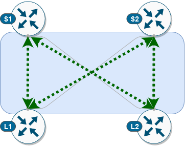

TASK 02: Provisioning of underlay configuration
===============================================

In this task, we will provision underlay configuration on our devices. This will include configuration of loopback and physical interfaces and as well OSPF and PIM protocols between spine and leaf devices. As a result, we will have full IP reachability between spine and leaf switches and our underlay network will support multicast routing which we can later use for replication of BUM traffic.

Before we can provision our configuration on devices, we must define variables like interface name, IP address, router IDs… for every device based on which ansible playbook can generate proper configuration for every device. Definition of these device variables can be found in below location. 

.. code-block:: console

    (ansible) ansible@iol-ansible:~/cat9k-evpn-ansible/dag$ ls host_vars/node_vars/
    Leaf-01.yml  Leaf-02.yml  Spine-01.yml  Spine-02.yml

As you can see, we have defined variables for every device. Feel free to take your time and examine variables definition for each device. In next step, we will preview configuration, which will be generated based on supplied host variables. To do this, we will execute our first ansible playbook via command below.

.. note::
    Ansible Playbook is simple configuration file containing repeatable tasks, which are executed on hosts defined in ansible inventory. 

.. code-block:: console

    (ansible) ansible@iol-ansible:~/cat9k-evpn-ansible/dag$ ansible-playbook -i inventory.yml playbook_underlay_preview.yml

Output from this ansible playbook can be found in the folder ``preview_files``. For every device, we have created separate file with generated configuration. Please, feel free to take your time to examine content of this folder. 

.. code-block:: console

    (ansible) ansible@iol-ansible:~/cat9k-evpn-ansible/dag$ ls preview_files/
    Leaf-01-underlay.txt  Leaf-02-underlay.txt  Spine-01-underlay.txt  Spine-02-underlay.txt

This way, we can preview and verify if generated device configuration is correct and if there are some adjustments should be made to our initial host variables. Once we are happy with our configuration, we can commit configuration on device via following ansible playbook.

.. code-block:: console

    (ansible) ansible@iol-ansible:~/cat9k-evpn-ansible/dag$ ansible-playbook -i inventory.yml playbook_underlay_commit.yml

After this step, ansible playbook connected to our devices and provisioned underlay configuration. Let’s have a brief look at control plane on the ``Leaf-01``. As you can see, our PIM and OSPF adjacencies between our spine and leaf devices are up. Now, we can proceed further with overlay configuration.

.. code-block:: console
    :linenos:
    :class: highlight-command highlight-command-12

    Leaf-01#show ip ospf neighbor 
    Neighbor ID     Pri   State           Dead Time   Address         Interface
    172.16.255.255    0   FULL/  -        00:00:35    172.16.23.2     Ethernet0/2
    172.16.255.1      0   FULL/  -        00:00:39    172.16.13.1     Ethernet0/1

    Leaf-01#show ip pim neighbor 
    PIM Neighbor Table
    Mode: B - Bidir Capable, DR - Designated Router, N - Default DR Priority,
        P - Proxy Capable, S - State Refresh Capable, G - GenID Capable,
        L - DR Load-balancing Capable
    Neighbor          Interface                Uptime/Expires    Ver   DR
    Address                                                            Prio/Mode
    172.16.13.1       Ethernet0/1              00:04:29/00:01:41 v2    1 / S P G
    172.16.23.2       Ethernet0/2              00:04:29/00:01:42 v2    1 / S P G

