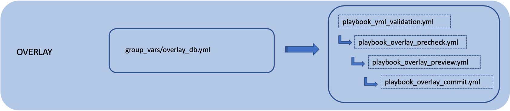

TASK 03: Provisioning of overlay configuration
==============================================

In this task, we will provision our overlay configuration on spine and leaf devices. This will include configuration of VRFs, extended VLANs along with SVI interfaces and VNI mappings, NVE interface and BGP protocol peerings under L2VPN EVPN address family. As a result, we will provision VRF green along with VLAN 101 (VNI 10101) with multicast replication of BUM traffic over group 225.0.0.101 and VLAN 102 (VNI 10102) with unicast, or ingress-replication of BUM traffic.

Same as it was for the underlay, we have to define our variables for overlay as well, so ansible can properly generate configuration for devices. Overlay variables can be found in the location below. Please, feel free to take your time to examine content of this file. 

.. code-block:: console

    (ansible) ansible@iol-ansible:~/cat9k-evpn-ansible/dag$ cat group_vars/overlay_db.yml

Please, note that you will see as well commented part of VRF blue configuration which will be performed in future task. Based on these variables, ansible playbook will generate our configuration for each device. To verify, if our overlay configuration is correct, we can run below playbook, which will go over overlay variables and verify, if our variables are logically correct.

.. code-block:: console

    (ansible) ansible@iol-ansible:~/cat9k-evpn-ansible/dag$ ansible-playbook -i inventory.yml playbook_yml_validation.yml

Since our previous playbook did not return any error, we can continue. In the next step, we will run playbook, which will verify health of our EVPN fabric, e.q. playbook will connect to devices and perform basic health checks like version, license, IP reachability, … on spine and leaf devices.

.. code-block:: console

    (ansible) ansible@iol-ansible:~/cat9k-evpn-ansible/dag$ ansible-playbook -i inventory.yml playbook_overlay_precheck.yml

As you can see, our playbook returned license error. This would be problem in real CAT9K devices, but since we are using engineering images virtualizing this functionality, we can omit this problem. Since neither of playbook found problem with either devices or overlay configuration, we will continue with generation and preview of our overlay configuration for devices. We will preview overlay configuration via below playbook. 

.. code-block:: console

    (ansible) ansible@iol-ansible:~/cat9k-evpn-ansible/dag$ ansible-playbook -i inventory.yml playbook_overlay_preview.yml

This playbook will create file for every device in ``preview_files`` folder with file suffix ``-overlay``. Please, feel free to take your time and examine content of those files.

.. code-block:: console

    (ansible) ansible@iol-ansible:~/cat9k-evpn-ansible/dag$ ls preview_files/ | grep overlay
    Leaf-01-overlay.txt
    Leaf-02-overlay.txt
    Spine-01-overlay.txt
    Spine-02-overlay.txt

Once we are happy with generated configuration, we can commit configuration to devices. We can accomplish this task via below ansible playbook. 

.. code-block:: console

    (ansible) ansible@iol-ansible:~/cat9k-evpn-ansible/dag$ ansible-playbook -i inventory.yml playbook_overlay_commit.yml

After this step, our ansible playbook connected to devices and provisioned our overlay configuration. We can now take a closer look at control plane state on Leaf-01. As you can see below, VRF green was configured along with SVIs 101, 102 and 901 (VLAN 901 is associated with L3 VNI for VRF green). Additionally, we can see that BGP peering’s with L2VPN EVPN address family with spine devices are established and we are receiving EVPN routes. Since we are receiving EVPN routes, Leaf-01 was able to discover NVE peer 172.16.254.4 – Leaf-02 in both L2 and L3 VNIs.

.. code-block:: console

    Leaf-01#sh vrf
    Name                 Default RD            Protocols   Interfaces
    green                1:1                   ipv4,ipv6   Vl101
                                                            Vl102
                                                            Vl901
                                                            Lo11
    mgmt                 <not set>             ipv4        Et1/3

    Leaf-01#sh bgp l2vpn evpn summary | beg Neighbor
    Neighbor        V           AS MsgRcvd MsgSent   TblVer  InQ OutQ Up/Down  State/PfxRcd
    172.16.255.1    4        65001      43      37       22    0    0 00:28:01        6
    172.16.255.2    4        65001      41      37       22    0    0 00:27:56        6

    Leaf-01#sh nve peers 
    'M' - MAC entry download flag  'A' - Adjacency download flag
    '4' - IPv4 flag  '6' - IPv6 flag

    Interface  VNI      Type Peer-IP          RMAC/Num_RTs   eVNI     state flags UP time
    nve1       50901    L3CP 172.16.254.4     aabb.cc80.0400 50901      UP  A/M/4 00:24:37
    nve1       10101    L2CP 172.16.254.4     3              10101      UP   N/A  00:24:37
    nve1       10102    L2CP 172.16.254.4     4              10102      UP   N/A  00:24:37
