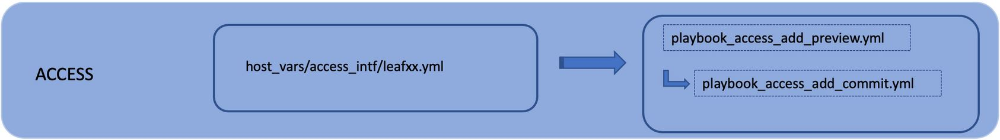
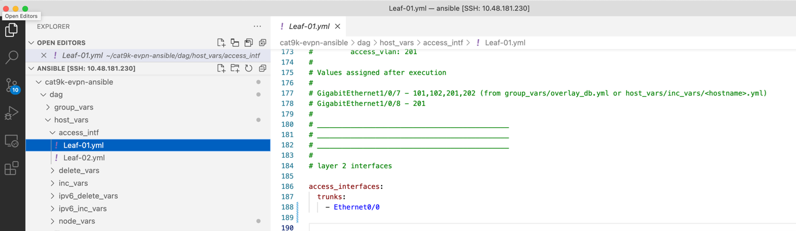
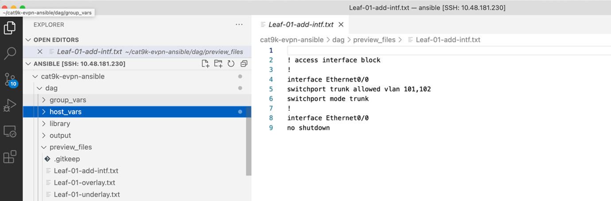

TASK 04: Provisioning of access interface configuration
=======================================================

In this task, we will be provisioning configuration of our access interfaces. Interfaces can be provisioned either as access or trunk with list of allowed vlans. As a result, we can connect our end host to provisioned ports in fabric, so they have access to network. 

Our configuration variables of access interfaces can be found in folder below. Folder holds file with variables for each device separately. Please, feel free to take your time to examine content of this folder.

.. code-block:: console

    (ansible) ansible@iol-ansible:~/cat9k-evpn-ansible/dag$ ls host_vars/access_intf/
    Leaf-01.yml  Leaf-02.yml

Configuration in this task is not so big as in previous task since we will be configuring only single interface – E0/0 as trunk interface. To preview our configuration, you can run below ansible playbook.

.. code-block:: console

    (ansible) ansible@iol-ansible:~/cat9k-evpn-ansible/dag$ ansible-playbook -i inventory.yml playbook_access_add_preview.yml

This ansible paybook will as well create configuration files in ``preview_files`` folder, but this time with ``-add-intf`` suffix. Please, feel free to take your time to examine content of this folder.

.. code-block:: console

    (ansible) ansible@iol-ansible:~/cat9k-evpn-ansible/dag$ ls preview_files/ | grep add
    Leaf-01-add-intf.txt
    Leaf-02-add-intf.txt

Once we are ready, we can commit the configuration on devices via playbook below.

.. code-block:: console

    (ansible) ansible@iol-ansible:~/cat9k-evpn-ansible/dag$ ansible-playbook -i inventory.yml playbook_access_add_commit.yml

After this step, devices were successfully configured and we can verify interface E0/0 configuration on our leaf devices. As you can see below, interface E0/0 was successfully configured. Since we did not specified list of VLAN of trunk, all L2VNI vlans – 101,102 were allowed on trunk.

.. code-block:: console

    Leaf-01#sh runn int e 0/0
    Building configuration...

    Current configuration : 159 bytes
    !
    interface Ethernet0/0
    switchport trunk encapsulation dot1q
    switchport trunk allowed vlan 101,102
    switchport mode trunk
    spanning-tree portfast trunk
