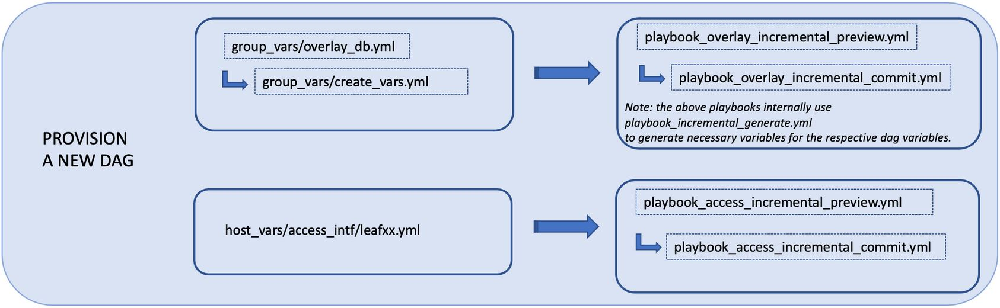
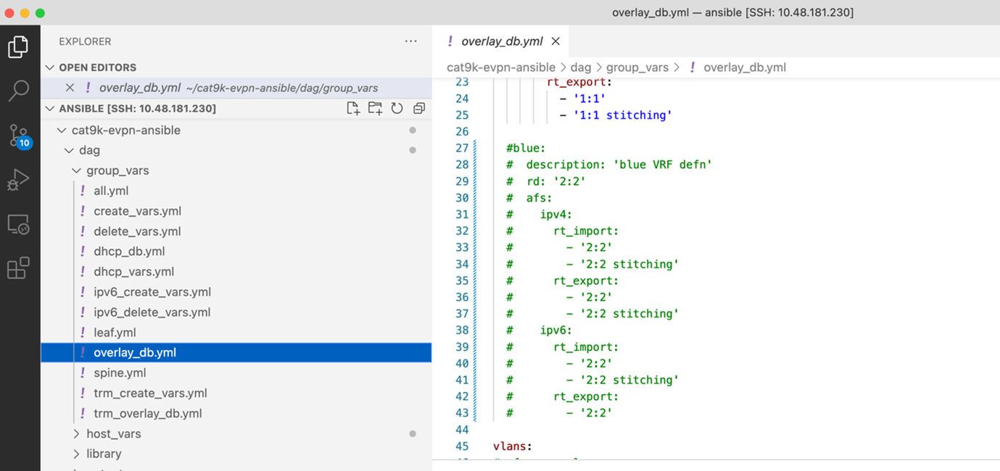
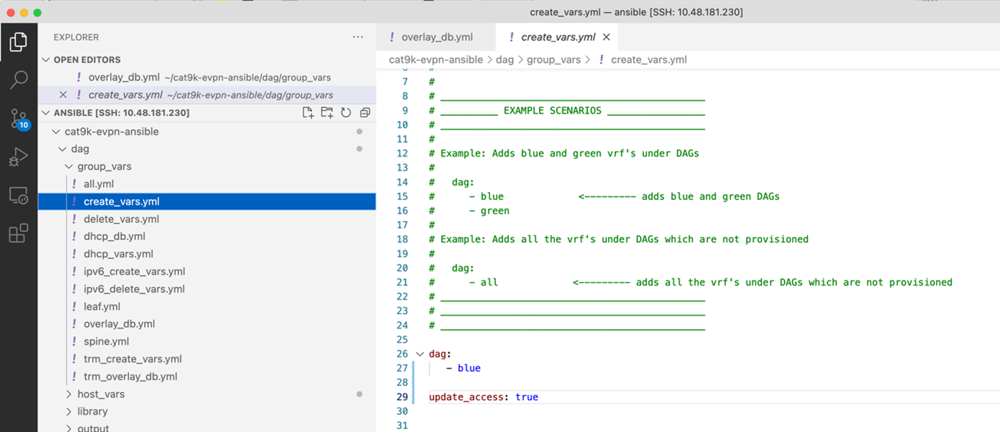
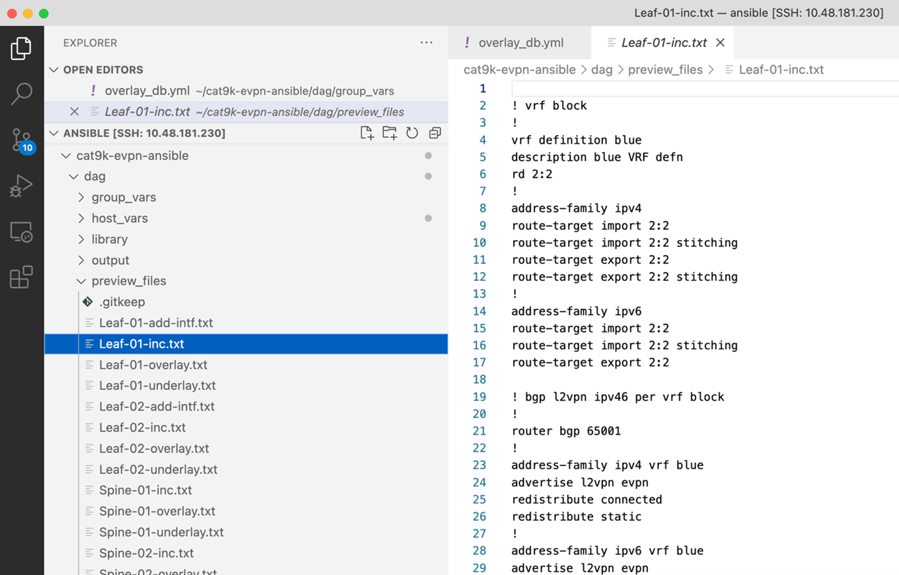
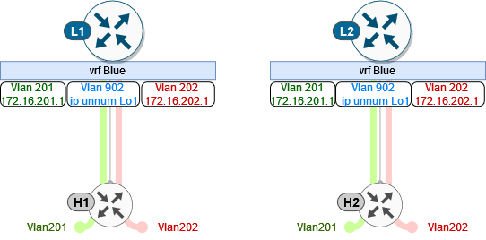

TASK 05: Incremental provisioning of new service
================================================

In this task, we will add additional service into our fabric – VRF blue. This will include configuration of VRF and L2/ L3 VNI vlans along with associated SVI interfaces. As a result, we will create new service which will be able to communicate across our fabric. 

As you could notice in previous task, we had configuration of VRF blue commented out. Therefore, we must go to our ``overlay_db`` and uncomment VRF blue configuration.

.. code-block:: console

    (ansible) ansible@iol-ansible:~/cat9k-evpn-ansible/dag$ cat group_vars/overlay_db.yml

You have to uncomment VRF blue configuration in following sections – vrfs, vlans and svis. Please, make sure that you will keep proper spacing and indentation between the lines. Also, please do not forget to save file after the changes are performed (CTRL + S).

.. note:: 
    To uncomment lines in VSCode, you can select commented lines with configuration and press ``CTRL + /``. You may find also this options under ``Edit -> Toggle Line Comment``.

In the next step, we will specify in the create variables that we want to provision only VRF blue and that we want to updated our access interfaces with VRF blue VLANs as well. Location for create variables can be found below.

.. code-block:: console

    (ansible) ansible@iol-ansible:~/cat9k-evpn-ansible/dag$ cat group_vars/create_vars.yml

After this step, we can preview our configuration which we are going to apply on our devices. To generate our configuration preview, we can run ansible playbook below.

.. code-block:: console

    (ansible) ansible@iol-ansible:~/cat9k-evpn-ansible/dag$ ansible-playbook -i inventory.yml playbook_overlay_incremental_preview.yml

This playbook also created files in the ``preview_files`` folder, but with ``-inc`` suffix. Please, note that we will provision only configuration relate to VRF blue only. Feel free to take your time to examine content in the folder.

.. code-block:: console

    (ansible) ansible@iol-ansible:~/cat9k-evpn-ansible/dag$ ls preview_files/ | grep inc
    Leaf-01-inc.txt
    Leaf-02-inc.txt
    Spine-01-inc.txt
    Spine-02-inc.txt

Once we are happy with the configuration, we can commit the changes on devices. To commit the changes, you can run ansible playbook below.

.. code-block:: console

    (ansible) ansible@iol-ansible:~/cat9k-evpn-ansible/dag$ ansible-playbook -i inventory.yml playbook_overlay_incremental_commit.yml

After this step, new VRF blue was provisioned on devices. Lets take a closer look on the ``Leaf-01`` control plane. As you can see below, VRF blue was created along with L2 VNI SVIs - Vlan 201 (VNI 10201) and Vlan 202 (VNI 10202) and L3 VNI SVI - Vlan 902 (VNI 50902). Also, ``Leaf-01`` was able to discover NVE peer 172.16.254.4 - ``Leaf-02`` for this new VNIs.

.. code-block:: console
    :linenos:
    :emphasize-lines: 3,4,5,19,22,23
    :class:  highlight-command highlight-command-23 emphasize-hll emphasize-hll-7 emphasize-hll-8 emphasize-hll-33 emphasize-hll-38 emphasize-hll-39

    Leaf-01#show vrf
    Name                             Default RD            Protocols   Interfaces
    blue                             2:2                   ipv4,ipv6   Vl201
                                                                       Vl202
                                                                       Vl902
                                                                       Lo12
    green                            1:1                   ipv4,ipv6   Vl101
                                                                       Vl102
                                                                       Vl901
                                                                       Lo11
    mgmt                             <not set>             ipv4        Et1/3

    Leaf-01#show nve peers
    'M' - MAC entry download flag  'A' - Adjacency download flag
    '4' - IPv4 flag  '6' - IPv6 flag

    Interface  VNI      Type Peer-IP          RMAC/Num_RTs   eVNI     state flags UP time
    nve1       50901    L3CP 172.16.254.4     aabb.cc80.0400 50901      UP  A/-/4 01:40:30
    nve1       50902    L3CP 172.16.254.4     aabb.cc80.0400 50902      UP  A/M/4 00:02:12
    nve1       10101    L2CP 172.16.254.4     5              10101      UP   N/A  01:40:30
    nve1       10102    L2CP 172.16.254.4     6              10102      UP   N/A  01:40:30
    nve1       10201    L2CP 172.16.254.4     3              10201      UP   N/A  00:02:14
    nve1       10202    L2CP 172.16.254.4     4              10202      UP   N/A  00:02:14

