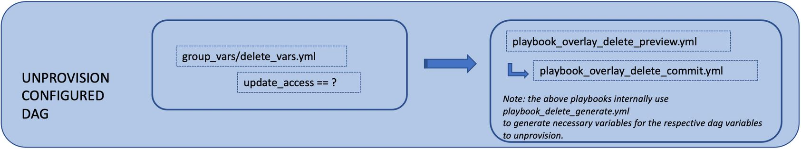
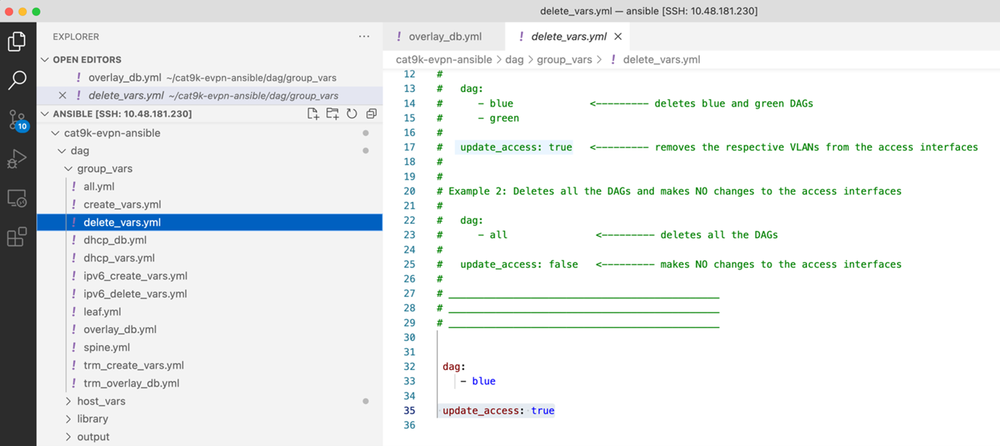
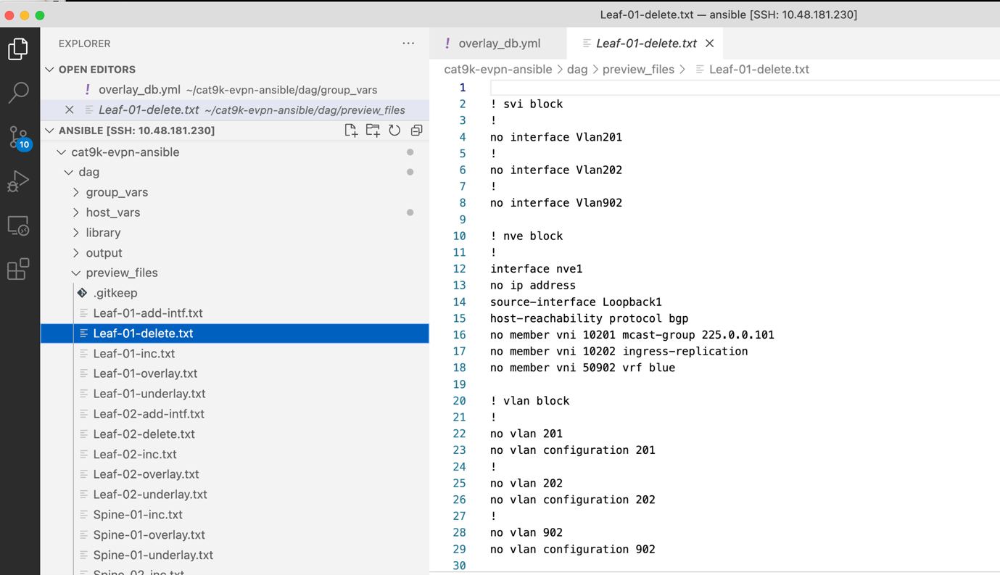

TASK 06: Unprovisioning of existing service
===========================================

In the last task, we will remove our previously created VRF from our network. This will include removal of interfaces and vlans associate with it along with the VRF instance as well. In result, service will be completely removed from our network. 

To delete specific instance from our devices, we must update delete variables where we will indicate, which VRF needs to be deleted. Delete variables can be found in the location below. 

.. code-block:: console

    (ansible) ansible@iol-ansible:~/cat9k-evpn-ansible/dag$ cat group_vars/delete_vars.yml

In delete variables, we will also specify that we want to update our access interfaces, so vlans associated with VRF blue will be automatically removed from device. In order to preview our delete configuration, you can run ansible playbook below.

.. code-block:: console

    (ansible) ansible@iol-ansible:~/cat9k-evpn-ansible/dag$ ansible-playbook -i inventory.yml playbook_overlay_delete_preview.yml

This playbook generated preview configuration into ``preview_files`` folder with ``-delete`` suffix. Please, feel free to take your time to examine content of the folder.

.. code-block:: console

    (ansible) ansible@iol-ansible:~/cat9k-evpn-ansible/dag$ ls preview_files/ | grep delete
    Leaf-01-delete.txt
    Leaf-02-delete.txt

Once we are ready, we can proceed with commit of changes into devices. To commit changes, we can run ansible playbook below.

.. code-block:: console

    (ansible) ansible@iol-ansible:~/cat9k-evpn-ansible/dag$ ansible-playbook -i inventory.yml playbook_overlay_delete_commit.yml

After this step, our VRF configuration was removed from devices. We can take a closer look again on ``Leaf-01``. As we can see below, VRF blue was removed.

.. code-block:: console
    :linenos:
    :class: highlight-command

    Leaf-01#show vrf
    Name                             Default RD            Protocols   Interfaces
    green                            1:1                   ipv4,ipv6   Vl101
                                                                       Vl102
                                                                       Vl901
                                                                       Lo11
    mgmt                             <not set>             ipv4        Et1/3

